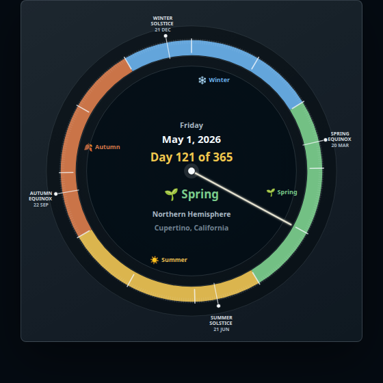

# Season Clock Card

Season Clock Card is a polished Home Assistant Lovelace card that shows a circular, location-aware seasonal year clock for your dashboard.

It includes basic and detailed modes, optional mode switching, compact solstice/equinox markers, daily and monthly tick marks, and Northern/Southern Hemisphere support based on configured latitude or explicit hemisphere selection.

The design is intentionally dashboard-focused: dark, compact, readable, and suitable for Home Assistant wall panels or overview pages.

If you enjoy Season Clock Card and want to support future development, you can buy me a coffee:

[Buy me a coffee](https://buymeacoffee.com/axelfair)
